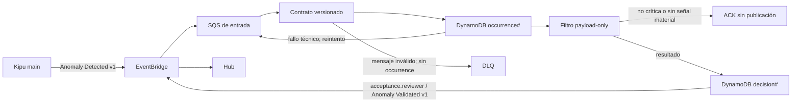

# Kipu Alert Reviewer

MVP asíncrono que evita que Hub muestre alertas de Kipu que no sean críticas o
que no estén respaldadas por las métricas estructuradas del propio evento. El
runtime está alineado con el contrato final `Anomaly Detected v1` /
`schema_version = 1.0` de Kipu `main`.

El worker no consulta Elastic, OpenSearch, Kibana, OpenAI ni APIs externas para
decidir. Consume el contrato real de Kipu y publica únicamente alertas críticas
de alta confianza.

## Estado actual

La primera entrega del MVP y la captura reviewer-only están implementadas. El
contrato se volvió a contrastar contra Kipu final `origin/main@d692b1b`:

- consume por SQS exclusivamente `acceptance.kipu / Anomaly Detected v1`;
- valida cada alerta únicamente con su payload;
- conserva para `1.0` la semántica critical-only de `2026-08-13.1`;
- captura en DynamoDB cada ocurrencia EventBridge versionada y estructuralmente
  válida antes de decidir, preservando el payload original;
- persiste la decisión bajo una identidad separada por evento;
- republica sólo las aceptadas como
  `acceptance.reviewer / Anomaly Validated v1`;
- cuenta con infraestructura AWS development y ya fue probado mediante un worker
  local conectado al bus real;
- mantiene el evaluador 2.0 sólo para reproducir evidencia histórica; no está
  conectado a la regla EventBridge activa;
- Phase 08 quedó verificada localmente con build Docker, E2E LocalStack y
  exportación de auditoría;
- exporta el archivo de ocurrencias del reviewer como conjuntos completos,
  únicos, válidos y válidos únicos para revisión manual;
- mantiene la DLQ local vacía en el recorrido aceptado/rechazado.

Todavía no es un servicio desatendido: falta desplegar el worker en ECS, ejecutar
la comparación shadow con Hub y cambiar Hub para consumir exclusivamente los
eventos validados.

La salida conserva `Anomaly Validated v1` y el reviewer no muta el payload
aceptado. El contrato final y las diferencias comprobadas se documentan en
[`docs/kipu-final-contract.md`](docs/kipu-final-contract.md).

## Flujo



El payload aceptado se republica completo para conservar campos de routing como
`alert_id`, `batch_id` y `group_name`.

Phase 08 no cambia la frecuencia, los payloads, el almacenamiento ni la
deduplicación de Kipu. El reviewer archiva únicamente los eventos que realmente
recibe desde EventBridge; por eso no afirma representar corridas internas o
alertas que el productor no haya publicado.

Cada envelope válido usa dos claves independientes en la misma tabla. La
ocurrencia se guarda como `occurrence#event:<event-id>` o, si falta el ID de
EventBridge, `occurrence#sha256:<hash-del-envelope>`. La decisión usa el mismo
identificador bajo `decision#…`. Un reintento del mismo evento reutiliza ambos
registros, mientras dos eventos diferentes con el mismo `alert_id` conservan
sus ocurrencias y decisiones por separado.

## Criterios

La política activa del runtime es:

| Entrada | Decisión |
|---|---|
| `schema_version = 1.0` | `version = 2026-08-13.1`: gates critical-only y seis ramas basadas en evidencia publicada. |

Se exige estructura válida, conteos y tasas coherentes,
`criticality = Critica`, al menos 20 transacciones, al menos 20 rechazos y una
de las seis ramas documentadas. Kipu final también usa internamente volumen
mínimo 20 y un guard de caída frente al baseline para caminos de un criterio,
pero no publica z-scores, flags ML ni componentes del score en el evento 1.0.
El reviewer no los infiere desde textos y mantiene su política independiente.

La criticidad, `priority_score`, `signal_codes`, descripciones y tipos de
anomalía nunca bastan solos. Los textos no se interpretan como evidencia. Los
criterios completos y los límites exactos están en
[`criteria.md`](.codex/skills/filter-valid-alerts/references/criteria.md); la
configuración ejecutable está en
[`config/filter_policy.yaml`](config/filter_policy.yaml).

### Revisión opcional con IA

El extractor manual del dashboard admite dos modos:

- `policy`: aplica únicamente el filtro determinístico versionado;
- `ai`: pide una segunda decisión a OpenAI o Gemini y devuelve sólo la intersección entre
  lo aceptado por la IA y lo aceptado por el filtro determinístico.

La IA recibe exclusivamente índices opacos, booleanos y métricas numéricas del
contrato `1.0`. No recibe MID, comercio, resumen, tipo de anomalía ni otros
textos libres. Usa Structured Outputs, no consulta herramientas externas y una
respuesta inválida o una indisponibilidad de la API falla de forma cerrada sin
guardar el resultado. La IA nunca puede ampliar lo aceptado por la política.

El proveedor se selecciona con `AI_PROVIDER=openai` (compatibilidad por defecto)
o `AI_PROVIDER=gemini`. OpenAI usa `OPENAI_API_KEY`, `OPENAI_MODEL` y
`OPENAI_TIMEOUT_SECONDS`; Gemini usa `GEMINI_API_KEY`, `GEMINI_MODEL` y
`GEMINI_TIMEOUT_SECONDS`. La clave debe almacenarse como
secreto de runtime; no se agrega al repositorio, al paquete del dashboard ni a
las respuestas HTTP. Los modelos por defecto son `gpt-5.6-luna` y
`gemini-3.1-flash-lite`, respectivamente. No hay cambio automático de proveedor
ni de modelo ante errores. Esta implementación local no configura ni despliega
el Lambda existente.

La consulta histórica de aceptación usa `HISTORY_ATHENA_TIMEOUT_SECONDS` y por
defecto espera hasta 180 segundos. Si Athena agota ese tiempo, la alerta se
conserva como `requires_review`; no se interpreta como confirmada ni como error
de Gemini.

### Guardian: revisión con histórico y Gemini (agente Python)

`GuardianAgent` integra la revisión de alertas con la investigación histórica:
evalúa la política, toma el MID y la fecha de generación, consulta los siete días
completos anteriores en `odl.card_transaction` y pide a Gemini una conclusión
citando métricas de la alerta y del histórico. Usa Athena y SSO `data-core`,
siguiendo la skill `kushki-datalake`. También puede investigar un MID sin alerta.

Se ejecuta mediante `scripts/run_guardian.py` o añadiendo `--guardian-history`
al extractor manual existente. No necesita dashboard, servidor HTTP ni Firebase.
Gemini recibe métricas y agregados numéricos, sin MID, fechas, nombres ni filas
transaccionales. La decisión de política y la conclusión de IA se guardan por
separado; el arreglo de alertas aceptadas conserva los payloads originales.

Este análisis es asesor: no reconstruye alertas históricas, no modifica la
criticidad ni las decisiones del worker y no demuestra que una alerta sea falsa.
La integración está en el agente local y no activa llamadas Athena/Gemini en
el consumidor SQS o Lambda desplegado.

En el dashboard propio (`dashboard/`, ruta `/`), cada alerta tiene un botón
**Generar conclusión**. Conserva automáticamente comercio, MID, payload original
y hora de Kipu; ya no requiere buscar el MID en una vista separada. `/guardian`
redirige a la lista. El protocolo local `guardian-alert-context-7d-v3` fija siete
días completos anteriores en UTC−5 y muestra un criterio explícito: **Autorizaciones**
(ventas y PREAUTHORIZATION, predeterminado) o **Sólo ventas** (SALE/DEFERRED/DEFFERED).
Ambos usan estados finales APPROVED/DECLINED, última versión por MID y
`transaction_code`, sin exigir ticket. Aceptación = aprobadas / (aprobadas +
rechazadas); CAPTURE nunca forma parte del denominador.

La misma consulta explica actividad excluida, llaves inválidas, borrados y estados
no finales. La ingesta observada no certifica frescura o cobertura global. Como
el payload actual no acredita la ventana y población exactas del incidente Kipu,
el nuevo analista sólo admite **Requiere revisión del analista**, con un motivo
y una acción; no confirma ni descarta por comparación con los siete días previos.
Sin resultados elegibles no se llama a Gemini ni se le atribuye un dictamen.

**Actualizar evidencia** genera una revisión nueva en
`reports/guardian-evidence/{case_id}/`, conservando las anteriores y validando la
cadena completa. Reintentar IA reutiliza la evidencia; volver a una conclusión
completada no consulta Athena ni Gemini. Cambiar el perfil, las métricas o la
política crea otra identidad; la hora de replay no. Los protocolos y archivos
anteriores se conservan para auditoría; el CLI histórico v2 no cambia.

El plan de evolución y sus comprobaciones se mantienen en
[el harness de Guardian analista](.planning/guardian-analyst/PLAN.md),
[estado](.planning/guardian-analyst/STATE.md) y
[validación](.planning/guardian-analyst/VALIDATION.md).

**Ejecutar agente** también funciona mediante el adaptador local: usa la fecha
seleccionada (día de publicación en Ecuador) e invoca la Lambda existente
`kipu-alert-reviewer-manual-extractor`. La Lambda lee las ocurrencias EventBridge
con su rol autorizado; el dashboard **no** asume `LocalWorkerRoleArn` ni consulta
DynamoDB directamente. No ejecuta una conclusión histórica ni requiere Gemini
en modo política. Usa el perfil `ia-dev-payments-intelligence` para invocar la
función. Su autenticación existente se conserva sólo en memoria del backend.
El perfil `data-core` corresponde sólo a la investigación histórica del Data Lake.
Si falta acceso, se muestra el error y se conserva el último snapshot exitoso;
no se sustituye la fecha pedida con el ejemplo ni con el snapshot del 31 de agosto.
No modifica permisos IAM, código ni configuración de la Lambda desplegada.

El dashboard compartido `acceptance-c-level-dashboard` no se modifica. Ejecutar
`npm run dev` dentro de `dashboard/` para usar el agente Python local; no está
conectado en el despliegue de Cloudflare. Si el almacenamiento de snapshots no
está disponible, puede mostrar el archivo explícitamente importado
`reports/guardian-dashboard-snapshot.json`, identificado como **copia local** y
con su fecha. Las filas de ejemplo o sin hora original no habilitan conclusiones.
Preparación, comandos, límites y consideraciones de privacidad:
[`docs/historical-analysis.md`](docs/historical-analysis.md).

Como evidencia histórica del modo `1.0`, al reevaluar con su semántica
`2026-08-13.1` las 50 alertas aceptadas por la política anterior el filtro
conservó 11 (22%) y descartó 39 (78%). Es un replay sobre un conjunto previamente
filtrado, no sobre el lote original completo ni una medición de `2.0`. El detalle
reproducible está en
[`critical-alerts-2026-08-13-policy-2026-08-13.1.md`](reports/critical-alerts-2026-08-13-policy-2026-08-13.1.md).

## Contenido del MVP

- `src/alert_reviewer/`: contrato Kipu, filtro, consumidor SQS, idempotencia y
  publicación EventBridge.
- `infra/sqs-worker.yaml`: regla, cola, DLQ, tabla y rol del worker local AWS.
- `compose.local.yaml` y `scripts/local_e2e.py`: topología local real con
  LocalStack.
- `scripts/evaluate_human_labels.py`: evaluación offline de conclusiones
  humanas contra la política versionada.
- `.codex/skills/filter-valid-alerts/`: skill que ejecuta el mismo filtro de
  producción.
- `.planning/`: requisitos, planes, resúmenes y verificaciones de Harness
  Engineering.

## Preparación

```powershell
py -3.12 -m venv .venv
.\.venv\Scripts\Activate.ps1
python -m pip install -e ".[dev]"
python -m pytest
python -m ruff check src tests scripts .codex/skills/filter-valid-alerts/scripts
```

Copiar `.env.example` a `.env` sólo cuando se vaya a arrancar el worker fuera de
los scripts incluidos. No guardar credenciales en el repositorio.

## Probar el filtro directamente

```powershell
.\.venv\Scripts\python.exe `
  .codex\skills\filter-valid-alerts\scripts\filter_alerts.py `
  examples\kipu-event.json
```

El comando prueba el contrato final `1.0`. La salida es un arreglo JSON que
contiene sólo las alertas aceptadas y conserva cada payload sin agregar campos.

## Exportar las ocurrencias recibidas durante un día

El worker guarda en su propia tabla DynamoDB cada evento Kipu `1.0` que
supera la validación estructural del envelope y del contrato. La captura ocurre
antes del filtro y de su clave de decisión, por lo que incluye tanto alertas
aceptadas como descartes de negocio. Un mensaje malformado no se archiva: queda
sin ACK para reintento y posterior redrive a la DLQ.

Este archivo pertenece al reviewer y no requiere cambios en Kipu. Tampoco es un
registro de cada ejecución interna del productor: sólo contiene los eventos que
EventBridge entregó al reviewer desde que esta versión del worker está activa.

Para reunir las publicaciones del 18 de agosto de 2026 según el día local de
Ecuador:

```powershell
.\.venv\Scripts\python.exe scripts\export_hourly_alert_audit.py 2026-08-18 `
  --date-basis publication `
  --timezone America/Guayaquil `
  --profile ia-dev-payments-intelligence
```

La base `publication` usa `time` del envelope EventBridge convertido a la zona
indicada; sólo si ese campo falta utiliza el timestamp contractual de la alerta.
Para reunir eventos `2.0` por su fecha transaccional explícita
`observation_date`, aunque se hayan publicado después por T+1:

```powershell
.\.venv\Scripts\python.exe scripts\export_hourly_alert_audit.py 2026-08-18 `
  --date-basis observation `
  --profile ia-dev-payments-intelligence
```

La base `observation` nunca infiere la fecha desde el timestamp de una alerta
`1.0`; esas ocurrencias se contabilizan como carentes de `observation_date` y no
entran en ese corte.

Cada ejecución crea bajo
`reports/reviewer-occurrences-<base>-<fecha>/`:

- `all.json`: todas las ocurrencias primarias, incluidas las predictivas `1.0`;
- `unique.json`: el último estado por `alert_id`, aunque ese estado sea un
  descarte de negocio;
- `valid.json`: todas las ocurrencias de `all.json` aceptadas por la política
  payload-only;
- `valid_unique.json`: la última ocurrencia aceptada por `alert_id`, calculada
  desde `valid.json` para que un rechazo posterior no borre una aceptación
  anterior;
- `summary.json`: contrato de exportación `1.1`, conteos de ocurrencias/válidas,
  exclusiones, zona horaria, versiones y fuente DynamoDB o local.

El mismo flujo puede probarse sin AWS pasando `--source` con registros de
ocurrencia decodificados o con la salida JSON de un scan DynamoDB. El repositorio
incluye un ejemplo reproducible:

```powershell
.\.venv\Scripts\python.exe scripts\export_hourly_alert_audit.py 2026-08-18 `
  --source examples\reviewer-occurrences.example.json `
  --output-dir reports\demo-reviewer-occurrences
```

El formato, las garantías de captura y la semántica de fechas están en
[`docs/hourly-audit.md`](docs/hourly-audit.md). El script
`export_manual_review_snapshot.py` se conserva como compatibilidad para el
snapshot diario histórico de Kipu; es una fuente distinta y no se mezcla con el
archivo de ocurrencias del reviewer.

## Evaluar conclusiones humanas

El repositorio incluye un evaluador offline que compara las decisiones de los
revisores con la política real del filtro:

```powershell
.\.venv\Scripts\python.exe scripts\evaluate_human_labels.py `
  examples\evaluation-cases.example.jsonl `
  examples\evaluation-labels.example.csv
```

Los archivos de ejemplo muestran el formato. Para una evaluación real:

1. Reunir entre 30 y 50 alertas anonimizadas, cubriendo las seis ramas críticas,
   `NON_CRITICAL_ALERT`, `NO_CRITICAL_SIGNAL`, eventos inválidos y fronteras.
2. Pedir a dos personas que etiqueten cada caso como `ACCEPT`, `REJECT` o
   `ABSTAIN`, sin ver el resultado del filtro ni la etiqueta de la otra persona.
3. Resolver discrepancias en una tercera pasada usando el `reviewer_id`
   `adjudicated`.
4. Ejecutar el script con los casos y etiquetas reales.

El reporte incluye cobertura, abstenciones, matriz TP/FP/FN/TN, acuerdo,
precision, recall, F1, balanced accuracy, Cohen's kappa y las discrepancias con
sus reason codes. La versión de la política se toma de
[`config/filter_policy.yaml`](config/filter_policy.yaml).

Estas métricas miden consistencia con la política payload-only. No demuestran por
sí solas que haya ocurrido un incidente operativo real. Tampoco se debe usar
accuracy como única métrica cuando predominan ampliamente los rechazos.

## Prueba local de extremo a extremo

Con Docker Desktop iniciado:

```powershell
docker build --no-cache -t kipu-alert-reviewer:mvp .
.\.venv\Scripts\python.exe scripts\local_e2e.py
```

La prueba levanta LocalStack, crea EventBridge, SQS, DLQ y DynamoDB antes de
arrancar el worker, y comprueba tres caminos para la versión del evento usado:

1. La alerta crítica respaldada se captura, obtiene una decisión durable, llega
   a Hub con `Anomaly Validated v1` y conserva su payload `1.0`.
2. Una variante estable también se captura, pero su decisión payload-only evita
   que llegue a Hub.
3. Una variante sin `merchant_name` falla antes de la captura y de la decisión,
   no llega a Hub y termina en la DLQ después del redrive.

Una ejecución correcta con el ejemplo `1.0` termina con un resumen similar a:

```json
{
  "accepted": {
    "accepted": true,
    "hub_source": "acceptance.reviewer",
    "hub_detail_type": "Anomaly Validated v1"
  },
  "rejected": {
    "accepted": false,
    "reason_codes": ["NO_CRITICAL_SIGNAL"],
    "reached_hub": false
  },
  "invalid": {
    "missing_field": "merchant_name",
    "persisted": false,
    "reached_hub": false,
    "reached_dlq": true
  }
}
```

También se puede usar un evento propio del contrato final:

```powershell
.\.venv\Scripts\python.exe scripts\local_e2e.py --event C:\ruta\evento.json
```

Para inspeccionar o detener la topología:

```powershell
docker compose -f compose.local.yaml logs -f local-worker
docker compose -f compose.local.yaml down
```

## Worker con eventos reales de AWS development

Después de autenticar el perfil de control:

```powershell
aws sso login --profile ia-dev-payments-intelligence --use-device-code
powershell -ExecutionPolicy Bypass -File scripts\start_aws_mvp_worker.ps1
```

El script lee los outputs del stack, usa el perfil asumible
`kipu-alert-reviewer-mvp` y escribe logs en
`%TEMP%\kipu-alert-reviewer-mvp`. Para detener sólo ese proceso:

```powershell
powershell -ExecutionPolicy Bypass -File scripts\stop_aws_mvp_worker.ps1
```

El worker carga la política al arrancar. Para activar una versión nueva hay que
reiniciarlo. La captura de Phase 08 todavía no fue desplegada en AWS: sólo un
worker actualizado empezará a crear registros `occurrence#…`, sin reconstruir
eventos anteriores. Las decisiones `READY` o `COMPLETED` usan `decision#event:`
y recurren a `decision#sha256:` únicamente si falta el ID del envelope. Un retry
del mismo evento reutiliza la decisión persistida y evita recalcularla durante
el TTL; la publicación continúa siendo at-least-once.

### Paso posterior a producción

El stack local/AWS actual usa por defecto `acceptance-intelligence-bus-dev`.
Kipu PROD publica en su bus de producción, por lo que habilitar tráfico real
requiere una decisión explícita: desplegar este stack en la misma cuenta de
PROD con `EventBusName=acceptance-intelligence-bus-prod`, o crear forwarding y
políticas EventBridge/SQS cross-account. Esta implementación no cambia ni
despliega recursos de producción automáticamente.

## Operación

| Resultado | `occurrence#` | Publicar | Borrar de SQS | DLQ |
|---|---:|---:|---:|---:|
| Alerta crítica aceptada | Sí | Sí | Sí | No |
| Alerta no crítica o sin señal material | Sí | No | Sí | No |
| Contrato o JSON inválido | No | No | No | Después del redrive |
| Fallo de captura/decisión/EventBridge | Reintento | Reintento | No | Después del redrive |
| Retry del mismo evento completado | Ya existe | No | Sí | No |

La entrega de salida es at-least-once. Hub debe consumir exclusivamente
`acceptance.reviewer / Anomaly Validated v1` y deduplicar por la identidad del
evento validado. Las claves internas `occurrence#…` y `decision#…` pertenecen al
reviewer y no se agregan al payload publicado.

## Harness Engineering

La trazabilidad de implementación y verificación está en [`.planning`](.planning):

- [`PROJECT.md`](.planning/PROJECT.md)
- [`REQUIREMENTS.md`](.planning/REQUIREMENTS.md)
- [`ROADMAP.md`](.planning/ROADMAP.md)
- [`STATE.md`](.planning/STATE.md)

La operación AWS se detalla en [`docs/sqs-worker.md`](docs/sqs-worker.md).
La evidencia del contrato Kipu `2.0` está en
[`07-VERIFICATION.md`](.planning/phases/07-kipu-main-v2-contract/07-VERIFICATION.md)
y la implementación reviewer-only de captura horaria, con verificación de
runtime todavía pendiente, en
[`08-VERIFICATION.md`](.planning/phases/08-hourly-alert-audit/08-VERIFICATION.md).
